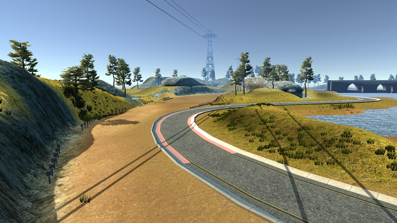
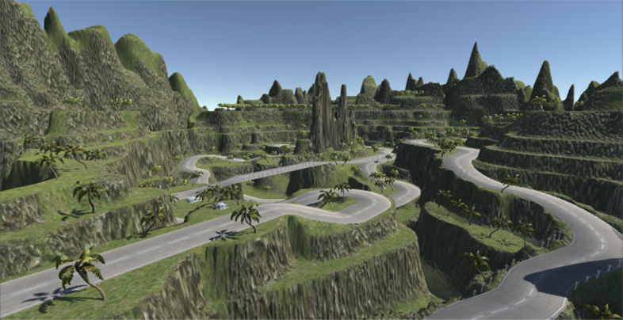

# **Behavioral Cloning** 


---


[//]: # (Image References)

[image1]: ./output/network_plot.png "Network Architecture"
[image2]: ./examples/lake.jpg "Track One"
[image3]: ./examples/jungle.jpg "Track Two"


---


### Project

The objective of this project is to teach the computer to drive car on on the basis of data collected in simulator provided by Udacity here. Here we apply the concepts of Deep Learning and Convolutional Neural Networks to teach the computer to drive car autonomously.

We feed the data collected from Simulator to our model, this data is fed in the form of images captured by 3 dashboard cams center, left and right. The output data contains a file data.csv which has the mappings of center, left and right images and the corresponding steering angle, throttle, brake and speed.

Using Keras Deep learning framework we can create a model.h5 file which we can test later on simulator with the command "python drive.py model.h5". This drive.py connects your model to simulator. The challenge in this project is to collect all sorts of training data so as to train the model to respond correctly in any type of situation.

#### Project Files

My project includes the following files:
* model.py containing the script to create and train the model
* drive.py for driving the car in autonomous mode
* model_track1.h5 containing a trained convolution neural network for track1
* model_track2.h5 containing a trained convolution neural network for track2
* writeup_report.md or writeup_report.pdf summarizing the results

#### Autonomous Simulation using the model file
Using the Udacity provided simulator and my drive.py file, the car can be driven autonomously around the track by executing 
```sh
python drive.py model.h5
```


### Preprocessing
The training data is recorded by the simulator, in the form of images, index by a .csv file.

Each image is converted to RGB format. Before feeding into the neural network, a Keras lambda layer is used to normalize the data. The unnecessary objects such as sky or car front were cropped from the data. 


### Data Augmentation
Images from all 3 cameras were used. A correction of 0.2 has been applied to compensate the vehicle heading angle for left and right cameras. 

Horizontal flipping is used to augment the data for track 1 since there is no lane divider. However, the flipping must be turned off for track 2 since there is lane divider and the flipped images were no longer representative of the driving.

Used generator to randomly shuffle and batch the images for training.


### Model Architecture

I used the [Nvidia model](https://devblogs.nvidia.com/deep-learning-self-driving-cars/) with the architecture as following:
Convolution: 5x5, filter: 24, strides: 2x2, activation: RELU
Convolution: 5x5, filter: 36, strides: 2x2, activation: RELU
Convolution: 5x5, filter: 48, strides: 2x2, activation: RELU
Convolution: 3x3, filter: 64, strides: 1x1, activation: RELU
Convolution: 3x3, filter: 64, strides: 1x1, activation: RELU
Drop out (0.5)
Fully connected: neurons: 100
Drop out (0.5)
Fully connected: neurons: 50
Drop out (0.2)
Fully connected: neurons: 10
Fully connected: neurons: 1 (output)


The model includes RELU layers to introduce nonlinearity.

![alt text][image1]

#### Attempts to reduce overfitting in the model

The model contains dropout layers in order to reduce overfitting.


#### Model parameter tuning

The model used an adam optimizer, so the learning rate was not tuned manually.

#### Training data collection

Training data was chosen to keep the vehicle driving on the road.

For Track 1, center lane driving seems to be sufficient for training.

For Track 2, I used a combination of center lane driving, recovering from the left and right sides of the road. Since this program only predicts the steering angle, it is necessary to match the playback speed of 9mph during turns.


### Training and Validation

In order to gauge how well the model was working, I split my image and steering angle data into a training and validation set. 

### Recorded Videos

<a href="https://youtu.be/Bv3jI9zTIoQ" target="_blank"></a>


<a href="https://youtu.be/tlTOCngXCC0" target="_blank"></a>

### Improvements

I would try grayscale with gradients and/or HLS/YUV channel information to further improve the model. Also in the real world, it is important to learn the driving scenario together with different type of sensor input, such as speed, braking. This way the vehicle's behavior is closer to the training. 

Another notion is that the data from a decent driver is very valuable. I tried to carefully manipulate the simulation vehicle. Even with 7 epochs of training, the model was able to complete track 2. In reality, if the vehicles are learning from all the drivers, we need to establish metrics to prioritize their learning from good drivers over bad drivers. 
